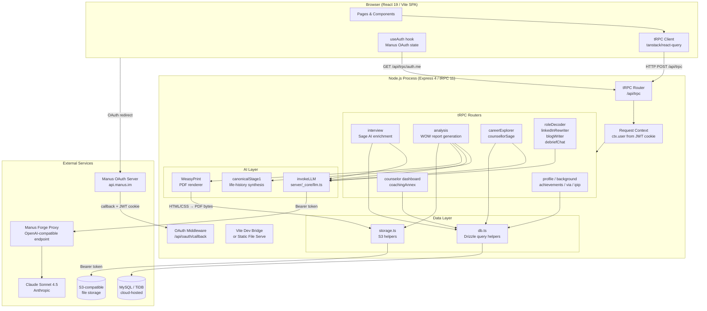
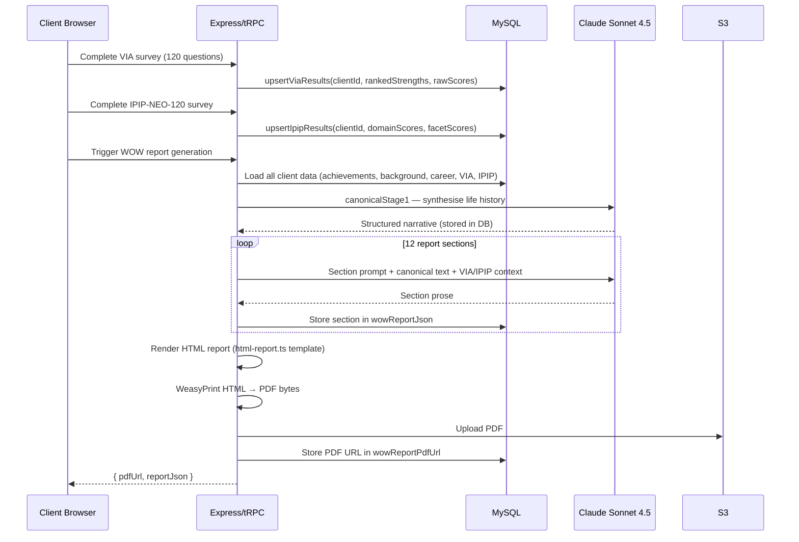

# 02 — Architecture Map

## Overview

LifeWorks is a **monolithic full-stack application** — a single Node.js process that serves both the React SPA and all API endpoints. There is no microservice boundary, no separate API gateway, and no message queue in the current architecture. All AI inference is synchronous within the request lifecycle.

---

## End-to-End Architecture Diagram

---

## Component Descriptions

### Front End

The front end is a React 19 single-page application built with Vite. Routing is handled by Wouter (lightweight, no React Router). All data fetching uses tRPC hooks (`trpc.*.useQuery`, `trpc.*.useMutation`) backed by TanStack Query. There is no Axios, no fetch wrapper, and no REST client. The `useAuth()` hook reads the current user from `trpc.auth.me.useQuery()`.

The front end is divided into two distinct "sites" within the same application:

- **Pennington Hennessy marketing site** — routes under `/`, `/coaching`, `/training`, `/about`. Navy/gold/cream brand, public-facing, no auth required.
- **LifeWorks coaching app** — routes under `/coaching/lifework/*` and `/dashboard`. Requires Manus OAuth login. Uses `LifeworkLayout` (PHNav + content).
- **Counsellor dashboard** — route `/counselor/*`. Requires OAuth + PIN gate.

### Back End

The Express server handles three categories of traffic:

1. **`/api/oauth/*`** — Manus OAuth flow (callback, state validation).
2. **`/api/trpc/*`** — All application logic, exposed as tRPC procedures. The router tree is defined in `server/routers.ts` and imports sub-routers from `server/routers/`.
3. **Static files** — In production, the Vite-built `dist/public/` directory is served directly by Express. In development, Vite runs as middleware.

### AI Layer

All AI inference is server-side. The entry point is `invokeLLM()` in `server/_core/llm.ts`, which:

1. Builds an OpenAI-compatible payload with `model: "claude-sonnet-4-5"`.
2. POSTs to the Manus Forge proxy (`BUILT_IN_FORGE_API_URL/v1/chat/completions`).
3. Returns an OpenAI-compatible response object.

The Forge proxy handles routing to Anthropic's API. The application never calls Anthropic directly in production (the `ANTHROPIC_API_KEY` env var exists as a fallback but is not used by the current `invokeLLM` implementation).

**Canonical Stage 1** (`server/routers/canonicalStage1.ts`) is a cached intermediate synthesis. Before generating the WOW report, the system runs a single LLM call that synthesises all of a client's life history data into a structured narrative. This canonical text is stored in `analysis_reports.canonicalStage1` and reused across all subsequent report sections, avoiding redundant context assembly.

**WOW Report generation** (`server/routers/wowReport.ts`) runs 12 sequential LLM calls — one per report section — each receiving the canonical stage 1 text plus section-specific instructions. Results are stored in `analysis_reports.wowReportJson` and the final HTML is rendered to PDF by WeasyPrint.

### PDF Generation

WeasyPrint is a Python library installed at server startup (`pip3 install weasyprint`). The server generates an HTML string from `server/html-report.ts` (a TypeScript template engine), then shells out to WeasyPrint to render it to PDF bytes, which are uploaded to S3. The PDF URL is stored in `analysis_reports.wowReportPdfUrl`.

---

## Data Flow: Psychometrics → AI Insights

---

## Counsellor Tools

The counsellor dashboard (`/counselor`) is a separate view of the same data, gated by PIN. It provides:

- **Client list** — all registered clients with completion status.
- **Client profile** — full data view, ability to add counsellor notes to achievements.
- **WOW report generation** — trigger report generation for any client, choose writing style and report type.
- **Coaching Annex** — paste a Sybill coaching transcript; the system generates a five-section closing annex in the counsellor's voice.
- **Counsellor Sage** — AI assistant that reads a client's full profile and answers counsellor questions.
- **Career Explorer (counsellor view)** — run a career exploration conversation on behalf of a client.
- **Insights Wheel** — visual PNG of the client's VIA/IPIP profile.
- **Blog Writer** — AI-assisted blog post generation for the PH website (counsellor-facing only).
