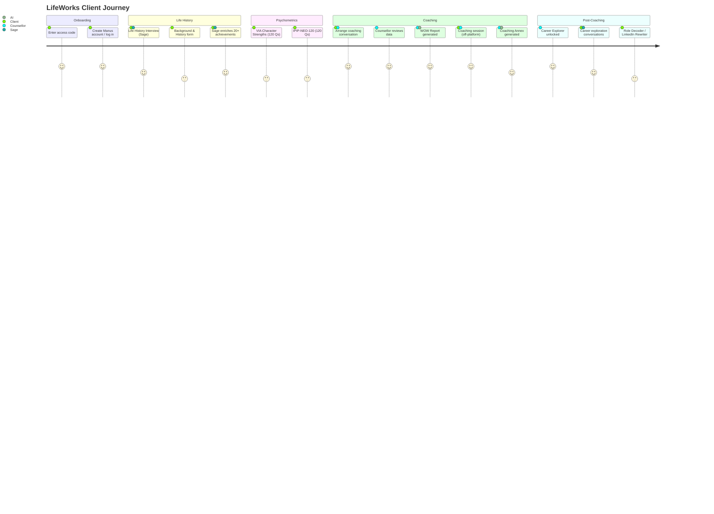

# 04 — Client Journey

## Overview

A client's journey through LifeWorks has six defined stages, presented as a numbered checklist on the dashboard (`/dashboard`). The journey is designed to be completed over several weeks, not in a single session. Each stage gates the next — psychometrics are not available until the life history interview is substantially complete; the Career Explorer is not available until the coaching conversation has taken place.

---

## Stage-by-Stage Journey

### Stage 1 — Life History Interview (`/coaching/lifework/interview`)

The client is interviewed by **Sage**, an AI interviewer, about their life achievements decade by decade (childhood, teens, twenties, thirties, forties, fifties, sixties+). Each achievement is entered as a free-text description. Sage then asks reflective follow-up questions to deepen each entry (`sageEnrichment`).

**Completion criterion:** At least 20 enriched achievements. The dashboard shows a progress counter (e.g. "14 / 20 events enriched by Sage").

**Data produced:** Rows in `achievements` table. Each row has `decade`, `title`, `age`, `description`, `esf` tag (enjoyable / satisfying / fulfilling), and `sageEnrichment`.

---

### Stage 2 — Background & History (`/coaching/lifework/background`)

A structured form capturing:
- Family background (parents' occupations, sibling position, upbringing location, family narrative, significant influences)
- Education history (institution, qualification, subject, years, highlights)
- Career history (organisation, role, years, responsibilities, why they left, highlights)

**Completion criterion:** At least one entry in each section (family, education, career). The dashboard shows a green tick when complete.

**Data produced:** Rows in `family_background`, `education_history`, `career_history`.

---

### Stage 3 — Sage Enrichment (inline, within Stage 1)

This is not a separate page but a status indicator on the dashboard. Sage's enrichment of achievements happens during Stage 1. The dashboard shows "Sage — Exploring your Life History" as a separate step to make the enrichment requirement explicit.

**Completion criterion:** 20+ achievements enriched by Sage.

---

### Stage 4 — Psychometrics (`/coaching/lifework/via` → `/coaching/lifework/ipip-survey`)

Two sequential assessments:

1. **VIA Character Strengths** — 120 questions, Likert scale. Produces a ranked list of 24 character strengths with scores. Results shown at `/coaching/lifework/via/results`.
2. **IPIP-NEO-120** — 120 questions, Big Five personality inventory. Produces domain scores (N, E, O, A, C, each 0–100) and 30 facet scores. Results shown at `/coaching/lifework/ipip-results`.

Both assessments are gated: the client cannot access them until Stage 1 (20 enriched achievements) is complete. Results are held (`/results-held`) until the counsellor reviews them.

**Data produced:** Rows in `via_results` and `ipip_results`.

---

### Stage 5 — Lifework Coaching (off-platform)

The client arranges a coaching conversation with a Pennington Hennessy counsellor. This happens off-platform (phone, video call). The dashboard shows a "Request a Coaching Date" button (currently a mailto link or contact form — not a booking system).

During or after this conversation, the counsellor:
- Reviews the client's data in the counsellor dashboard
- Generates the **WOW report** (the AI-authored 12-chapter career analysis)
- Optionally adds counsellor notes to achievements
- Generates a **Coaching Annex** from the session transcript

**Data produced:** `analysis_reports.wowReportJson`, `analysis_reports.wowReportPdfUrl`, `coaching_annexes`.

---

### Stage 6 — Career Explorer (`/coaching/lifework/career-explorer`)

After the coaching conversation, the counsellor unlocks the Career Explorer for the client (`careerExplorerUnlocked = true`). The client can then:
- Have open-ended career exploration conversations with Sage
- Ask Sage to evaluate specific roles against their profile
- Explore challenges a potential career might bring

**Data produced:** Rows in `career_explorer_sessions`.

---

## Journey Map

---

## Natural Insertion Point for the Jobs Module

The Jobs / Opportunities module sits most naturally at **Stage 6 — Post-Coaching**, as a new tab or section within the Career Explorer area. By this point:

- The client has a completed WOW report (`wowReportJson`) — the richest possible profile of who they are and what they are looking for.
- The `canonicalStage1` synthesis is available — a 2,000-word structured narrative ready to use as a matching prompt.
- The client has had a coaching conversation and has at least a provisional sense of direction.
- The Career Explorer is already unlocked, so the client is in "exploration mode."

**Alternative insertion point:** A standalone "Jobs" step could be added as Stage 7, appearing on the dashboard after Stage 6 is unlocked. This would give it equal visual weight to the other stages and make it feel like a natural progression rather than a feature.

**What the module would receive from the existing platform:**
- `canonicalStage1` — structured life narrative
- `wowReportJson.careerDirections` — the three career directions identified in the WOW report
- `via_results.rankedStrengths` — top character strengths
- `ipip_results.domainScores` — Big Five profile
- `client_profiles.targetRole` — if set by the client
- `career_history` — current and past roles (for seniority / sector context)
